# Блок-схемы процессов системы

## Оглавление
1. [Процесс создания и согласования приказа](#процесс-создания-и-согласования-приказа)
2. [Процесс отправки заявки в учебный центр](#процесс-отправки-заявки-в-учебный-центр)
3. [Процесс обработки заявки учебным центром](#процесс-обработки-заявки-учебным-центром)
4. [Процесс проведения обучения](#процесс-проведения-обучения)
5. [Процесс передачи сертификатов](#процесс-передачи-сертификатов)
6. [Процесс добавления контрагента с валидацией](#процесс-добавления-контрагента-с-валидацией)
7. [Общая схема взаимодействия модулей](#общая-схема-взаимодействия-модулей)

---

## Процесс создания и согласования приказа

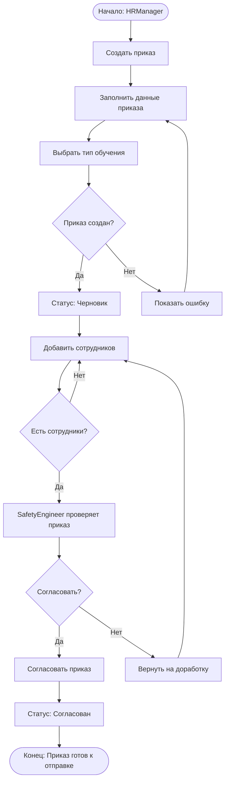

---

## Процесс отправки заявки в учебный центр

```mermaid
flowchart TD
    Start([Начало: Приказ согласован]) --> ClickButton[Нажать "Учебный центр"]
    ClickButton --> OpenDialog[Открыть диалог выбора УЦ]
    
    OpenDialog --> HasContractors{Есть контрагенты?}
    
    HasContractors -->|Нет| ShowError[Ошибка: Нет УЦ в контрагентах]
    ShowError --> GoToSettings[Перейти в Настройки]
    GoToSettings --> AddContractor[Добавить контрагента]
    AddContractor --> OpenDialog
    
    HasContractors -->|Да| SelectTC[Выбрать учебный центр]
    SelectTC --> SelectType[Выбрать тип заявки]
    
    SelectType --> TypeDecision{Тип заявки?}
    
    TypeDecision -->|Полное обучение| FullTraining[requestType: full_training]
    TypeDecision -->|Только СДО| SDOAccess[requestType: sdo_access_only]
    
    FullTraining --> CheckTenantId{У контрагента есть tenantId?}
    SDOAccess --> CheckTenantId
    
    CheckTenantId -->|Да| AutoSend[Автоматическая передача в trainingCenterStore]
    CheckTenantId -->|Нет| ManualSend[Ручная передача через внешние каналы]
    
    AutoSend --> CreateRequest[Создать заявку в УЦ]
    CreateRequest --> LinkToOrder[Связать заявку с приказом]
    LinkToOrder --> UpdateOrderStatus[order.trainingCenterRequestId = requestId]
    
    ManualSend --> CreateRequestManual[Создать запись о заявке]
    CreateRequestManual --> NotifyManual[Уведомить пользователя]
    
    UpdateOrderStatus --> End([Конец: Заявка отправлена])
    NotifyManual --> End
```

---

## Процесс обработки заявки учебным центром

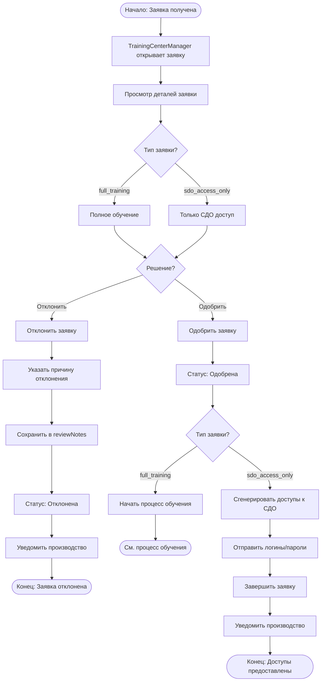

---

## Процесс проведения обучения

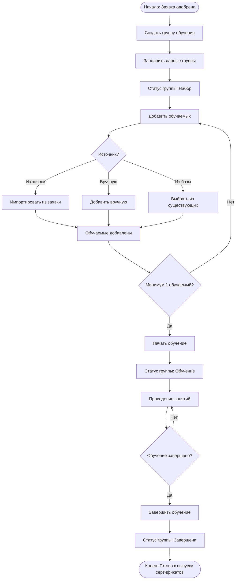

---

## Процесс передачи сертификатов

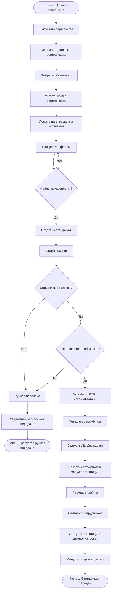

---

## Процесс добавления контрагента с валидацией

```mermaid
flowchart TD
    Start([Начало: TenantAdmin]) --> ClickAdd[Нажать "Добавить контрагента"]
    ClickAdd --> OpenDialog[Открыть диалог]
    
    OpenDialog --> SelectType[Выбрать тип контрагента]
    SelectType --> TypeDecision{Тип?}
    
    TypeDecision -->|Учебный центр| TC[type: training_center]
    TypeDecision -->|Подрядчик| Contractor[type: contractor]
    TypeDecision -->|Поставщик| Supplier[type: supplier]
    
    TC --> EnterTenantId[Ввести ID организации в системе]
    Contractor --> FillManual[Заполнить вручную]
    Supplier --> FillManual
    
    EnterTenantId --> HasTenantId{ID указан?}
    
    HasTenantId -->|Нет| FillManual
    HasTenantId -->|Да| StartValidation[Запустить валидацию]
    
    StartValidation --> ShowLoader[Показать индикатор загрузки]
    ShowLoader --> CheckOwnId{ID = свой tenantId?}
    
    CheckOwnId -->|Да| ErrorOwn[Ошибка: Нельзя указать свою организацию]
    CheckOwnId -->|Нет| CheckExists{Организация существует?}
    
    CheckExists -->|Нет| ErrorNotFound[Ошибка: Организация не найдена]
    CheckExists -->|Да| CheckModule{Для УЦ: есть модуль training-center?}
    
    CheckModule -->|Нет| ErrorNoModule[Ошибка: Не является учебным центром]
    CheckModule -->|Да| ValidationSuccess[Валидация успешна]
    
    ValidationSuccess --> ShowSuccess[Показать зеленую галочку]
    ShowSuccess --> AutoFill[Автозаполнить название и ИНН]
    AutoFill --> FillManual
    
    ErrorOwn --> ShowError1[Показать красный крестик]
    ErrorNotFound --> ShowError1
    ErrorNoModule --> ShowError1
    ShowError1 --> EnterTenantId
    
    FillManual --> FillServices[Выбрать услуги]
    FillServices --> FillContract[Данные договора]
    FillContract --> FillContacts[Контактная информация]
    FillContacts --> ClickSave[Нажать "Добавить"]
    
    ClickSave --> ValidateForm{Форма валидна?}
    
    ValidateForm -->|Нет| ShowFormError[Показать ошибки]
    ShowFormError --> FillManual
    
    ValidateForm -->|Да| CheckTenantIdError{Есть ошибка валидации tenantId?}
    
    CheckTenantIdError -->|Да| BlockSave[Заблокировать сохранение]
    BlockSave --> ShowToast[Toast: Исправьте ошибки]
    ShowToast --> EnterTenantId
    
    CheckTenantIdError -->|Нет| SaveContractor[Сохранить контрагента]
    SaveContractor --> AddToList[Добавить в список]
    AddToList --> ShowBadge{contractorTenantId указан?}
    
    ShowBadge -->|Да| DisplayWithBadge[Показать badge "В системе"]
    ShowBadge -->|Нет| DisplayNormal[Показать без badge]
    
    DisplayWithBadge --> End([Конец: Контрагент добавлен])
    DisplayNormal --> End
```

---

## Общая схема взаимодействия модулей

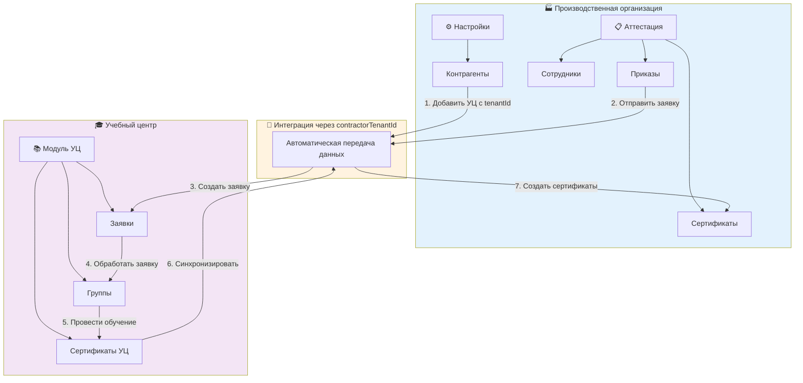

---

## Схема статусов приказа

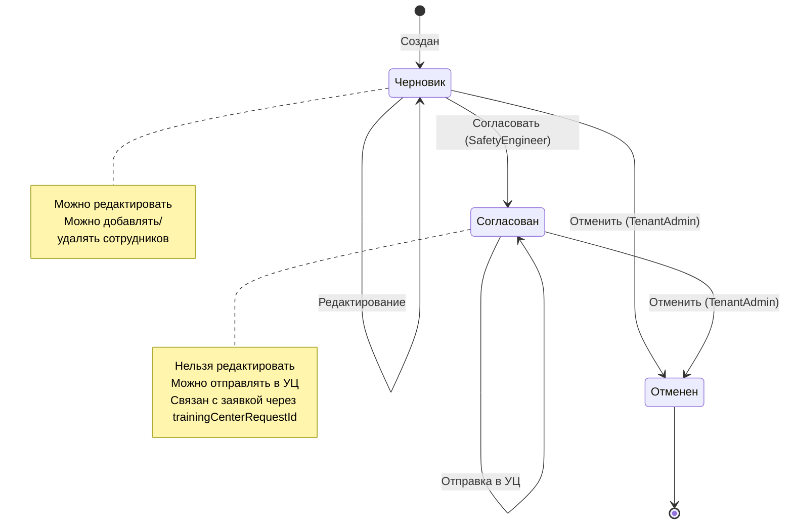

---

## Схема статусов заявки (УЦ)

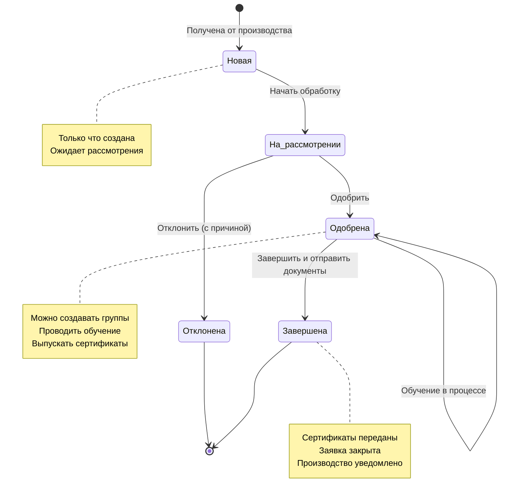

---

## Схема статусов группы обучения

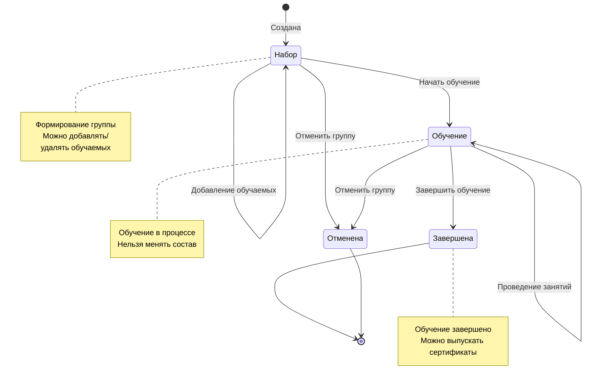

---

## Схема жизненного цикла сертификата

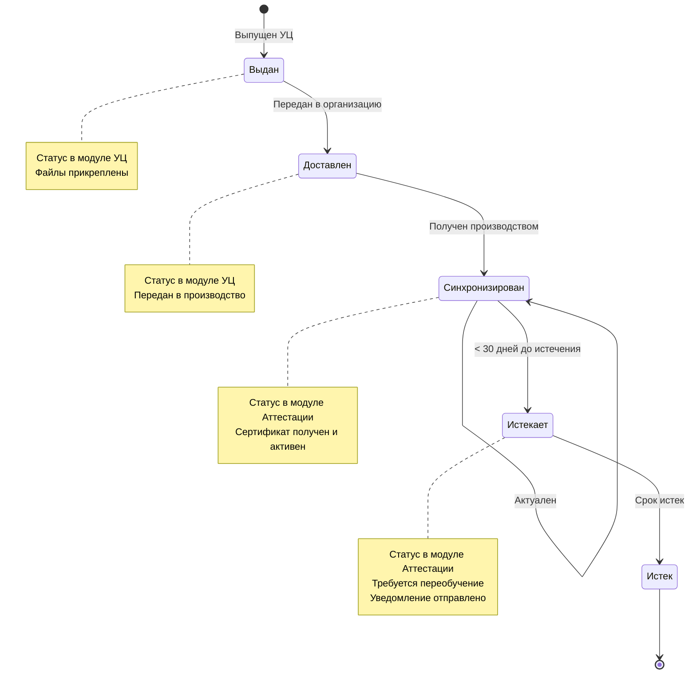

---

## Схема принятия решения при отправке заявки

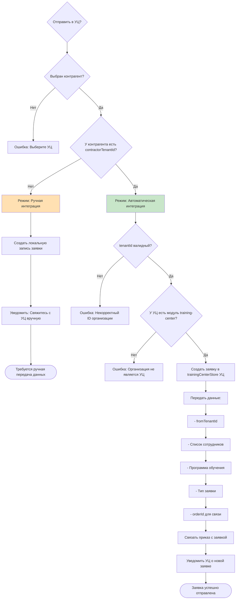

---

## Схема валидации ID организации

```mermaid
flowchart TD
    Start[Ввод contractorTenantId] --> Trim[Убрать пробелы]
    Trim --> IsEmpty{Пустое значение?}
    
    IsEmpty -->|Да| ClearState[Очистить состояние валидации]
    ClearState --> EndEmpty([Валидация не требуется])
    
    IsEmpty -->|Нет| ShowLoader[Показать индикатор загрузки]
    ShowLoader --> CheckSelf{tenantId == currentUser.tenantId?}
    
    CheckSelf -->|Да| SetError1[Ошибка: Нельзя указать свою организацию]
    SetError1 --> ShowRed1[Красная рамка + крестик]
    ShowRed1 --> EndError1([Валидация не прошла])
    
    CheckSelf -->|Нет| FetchTenant[Запрос информации об организации]
    FetchTenant --> Wait[Ожидание 500ms]
    Wait --> TenantExists{Организация найдена?}
    
    TenantExists -->|Нет| SetError2[Ошибка: Организация не найдена]
    SetError2 --> ShowRed2[Красная рамка + крестик]
    ShowRed2 --> EndError2([Валидация не прошла])
    
    TenantExists -->|Да| CheckType{Тип = training_center?}
    
    CheckType -->|Нет| Skip[Пропустить проверку модуля]
    CheckType -->|Да| CheckModule{Есть модуль training-center?}
    
    CheckModule -->|Нет| SetError3[Ошибка: Не является учебным центром]
    SetError3 --> ShowRed3[Красная рамка + крестик]
    ShowRed3 --> EndError3([Валидация не прошла])
    
    CheckModule -->|Да| SetSuccess[Валидация успешна]
    Skip --> SetSuccess
    
    SetSuccess --> ShowGreen[Зеленая рамка + галочка]
    ShowGreen --> AutoFill[Автозаполнить название и ИНН]
    AutoFill --> DisplayInfo[Показать: "Найдена организация: [Название]"]
    DisplayInfo --> EndSuccess([Валидация пройдена])
    
    style SetSuccess fill:#c8e6c9
    style SetError1 fill:#ffcdd2
    style SetError2 fill:#ffcdd2
    style SetError3 fill:#ffcdd2
```

---

## Диаграмма процесса мониторинга истечения сертификатов

```mermaid
flowchart TD
    Start([Автоматическая проверка ежедневно]) --> GetAllCerts[Получить все сертификаты]
    GetAllCerts --> CheckEach[Проверить каждый сертификат]
    
    CheckEach --> CalcDays[Вычислить дни до истечения]
    CalcDays --> Decision{Дней до истечения?}
    
    Decision -->|> 30| MarkActive[Статус: Синхронизирован]
    Decision -->|<= 30 и > 0| MarkExpiring[Статус: Истекает]
    Decision -->|<= 0| MarkExpired[Статус: Истек]
    
    MarkActive --> NextCert{Есть еще сертификаты?}
    
    MarkExpiring --> SendNotification1[Отправить уведомление]
    SendNotification1 --> NotifyText1[За 30 дней: Сертификат истекает]
    NotifyText1 --> NextCert
    
    MarkExpired --> SendNotification2[Отправить уведомление]
    SendNotification2 --> NotifyText2[Сертификат истек]
    NotifyText2 --> NextCert
    
    NextCert -->|Да| CheckEach
    NextCert -->|Нет| FilterExpiring[Фильтр "Истекает" в UI]
    
    FilterExpiring --> ShowBadge[Показать badge с предупреждением]
    ShowBadge --> EnableAction[Доступна кнопка "Создать приказ на переобучение"]
    EnableAction --> End([Конец: Мониторинг завершен])
    
    style MarkExpiring fill:#fff9c4
    style MarkExpired fill:#ffcdd2
```

---

## Схема прав доступа

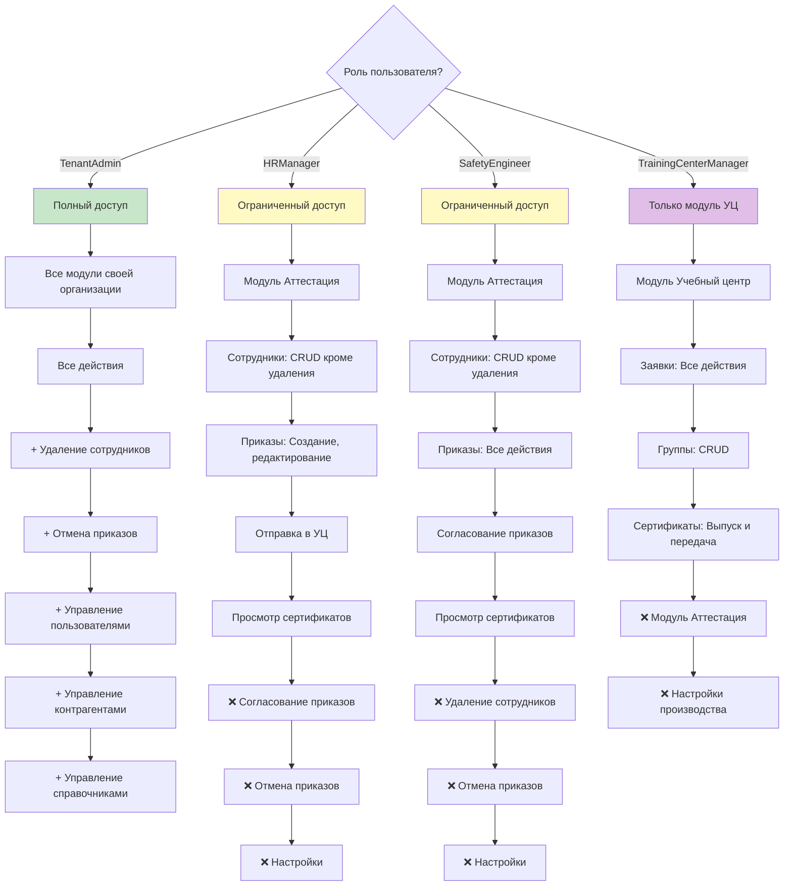

---

## Легенда символов

- 🏭 Производственная организация
- 🎓 Учебный центр
- ⚙️ Настройки
- 📋 Аттестация
- 📚 Модуль Учебный центр
- 🔄 Автоматическая интеграция
- ✅ Действие разрешено
- ❌ Действие запрещено
- ⏳ Процесс в ожидании
- 📝 Документ создан
- 📤 Отправка данных
- 📥 Получение данных
