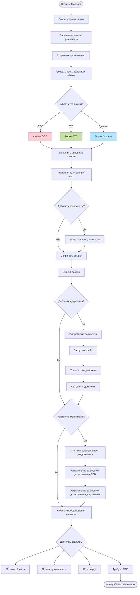
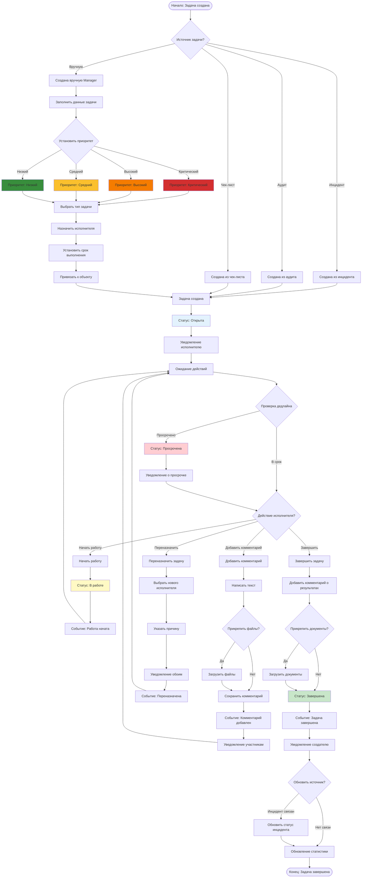
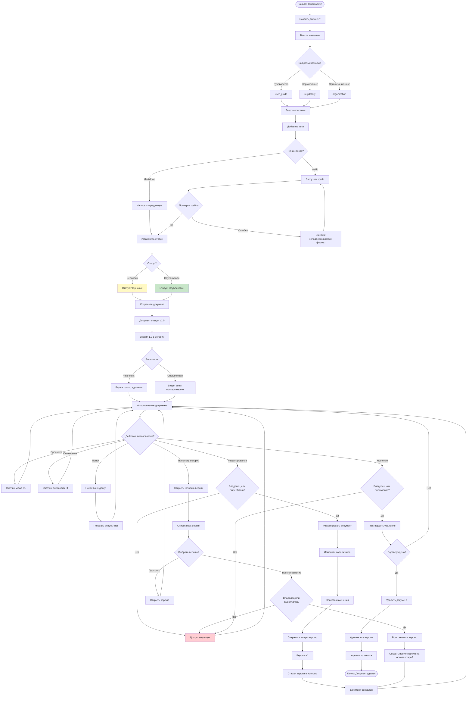

# Блок-схемы процессов - Дополнительные модули

## Оглавление
1. [Процесс управления промышленным объектом](#процесс-управления-промышленным-объектом)
2. [Процесс управления инцидентом](#процесс-управления-инцидентом)
3. [Процесс проведения аудита](#процесс-проведения-аудита)
4. [Процесс выполнения задачи](#процесс-выполнения-задачи)
5. [Процесс планирования бюджета](#процесс-планирования-бюджета)
6. [Процесс управления документами в базе знаний](#процесс-управления-документами-в-базе-знаний)
7. [Схема автоматических уведомлений](#схема-автоматических-уведомлений)
8. [Общая схема интеграции всех модулей](#общая-схема-интеграции-всех-модулей)

---

## Процесс управления промышленным объектом

---

## Процесс управления инцидентом

```mermaid
flowchart TD
    Start([Начало: Инцидент выявлен]) --> Source{Источник?}
    
    Source -->|Аудит| FromAudit[Создан автоматически из аудита]
    Source -->|Внутренняя проверка| ManualCreate[Создан вручную Manager]
    Source -->|Внешняя проверка| ManualCreate
    Source -->|Сообщение работника| ManualCreate
    
    FromAudit --> IncidentCreated[Инцидент создан]
    ManualCreate --> FillData[Заполнить данные]
    FillData --> SelectDirection[Выбрать направление]
    
    SelectDirection --> Direction{Направление?}
    
    Direction -->|ПБ| PBS[Пожарная безопасность]
    Direction -->|Энергобезопасность| Energy[Энергобезопасность]
    Direction -->|ОТ| Labor[Охрана труда]
    Direction -->|Эксплуатация| Equipment[Эксплуатация оборудования]
    
    PBS --> SetCategory[Установить категорию 1-3]
    Energy --> SetCategory
    Labor --> SetCategory
    Equipment --> SetCategory
    
    SetCategory --> SetFunding[Выбрать тип финансирования]
    
    SetFunding --> Funding{Тип финансирования?}
    
    Funding -->|CAPEX| CapexPlan[Требуется планирование в бюджете]
    Funding -->|OPEX| OpexPlan[Текущие расходы]
    Funding -->|Силами площадки| OwnForces[Без бюджета]
    
    CapexPlan --> SetDeadline[Установить плановую дату]
    OpexPlan --> SetDeadline
    OwnForces --> SetDeadline
    
    SetDeadline --> AssignResponsible[Назначить ответственного]
    AssignResponsible --> IncidentCreated
    
    IncidentCreated --> StatusCreated[Статус: Создан]
    StatusCreated --> AutoTask{Создать задачу?}
    
    AutoTask -->|Да| CreateTask[Автоматическое создание задачи]
    AutoTask -->|Нет| WaitAction[Ожидание действий]
    
    CreateTask --> NotifyResponsible[Уведомление ответственному]
    NotifyResponsible --> WaitAction
    
    WaitAction --> Action{Действие?}
    
    Action -->|Начать работу| StatusInProgress[Статус: В работе]
    Action -->|На согласование| StatusAwaiting[Статус: Ожидает согласования]
    Action -->|Завершить| CompleteIncident[Завершить инцидент]
    
    StatusInProgress --> DoWork[Выполнение работ]
    DoWork --> Action
    
    StatusAwaiting --> AwaitApproval[Ожидание согласования]
    AwaitApproval --> ApprovalDecision{Согласовано?}
    
    ApprovalDecision -->|Да| CompleteIncident
    ApprovalDecision -->|Нет| StatusInProgress
    
    CompleteIncident --> SetCompleteDate[Указать фактическую дату]
    SetCompleteDate --> CheckDeadline{Выполнено в срок?}
    
    CheckDeadline -->|Да| StatusCompleted[Статус: Выполнено]
    CheckDeadline -->|Нет| StatusCompletedLate[Статус: Выполнено с опозданием]
    
    StatusCompleted --> UpdateStats[Обновление статистики]
    StatusCompletedLate --> CalcDelay[Расчет дней задержки]
    CalcDelay --> UpdateStats
    
    UpdateStats --> KanbanMove{Перемещение в канбане}
    KanbanMove --> AnalyticsUpdate[Обновление аналитики]
    AnalyticsUpdate --> End([Конец: Инцидент завершен])
    
    style StatusCreated fill:#e3f2fd
    style StatusInProgress fill:#fff9c4
    style StatusAwaiting fill:#ffecb3
    style StatusCompleted fill:#c8e6c9
    style StatusCompletedLate fill:#ffcdd2
```

---

## Процесс проведения аудита

```mermaid
flowchart TD
    Start([Начало: Auditor]) --> CreateChecklist[Создать чек-лист]
    CreateChecklist --> AddItems[Добавить пункты проверки]
    
    AddItems --> AddItem[Добавить пункт]
    AddItem --> SetCriticality[Установить критичность]
    SetCriticality --> RequireComment{Требуется комментарий?}
    
    RequireComment -->|Да| MarkRequired[Отметить обязательность]
    RequireComment -->|Нет| NextItem{Еще пункты?}
    MarkRequired --> NextItem
    
    NextItem -->|Да| AddItem
    NextItem -->|Нет| SaveChecklist[Сохранить чек-лист]
    
    SaveChecklist --> SaveTemplate{Сохранить как шаблон?}
    
    SaveTemplate -->|Да| CreateTemplate[Создать шаблон]
    SaveTemplate -->|Нет| ScheduleAudit[Запланировать аудит]
    CreateTemplate --> ScheduleAudit
    
    ScheduleAudit --> SelectChecklist[Выбрать чек-лист]
    SelectChecklist --> SetDate[Установить дату проведения]
    SetDate --> SelectObject[Выбрать объект проверки]
    SelectObject --> AssignAuditor[Назначить аудитора]
    AssignAuditor --> AuditScheduled[Аудит запланирован]
    
    AuditScheduled --> NotifyAuditor[Уведомление аудитора]
    NotifyAuditor --> WaitDate[Ожидание даты проведения]
    
    WaitDate --> DateArrived{Дата наступила?}
    
    DateArrived -->|Нет| WaitDate
    DateArrived -->|Да| StartAudit[Начать аудит]
    
    StartAudit --> StatusInProgress[Статус: В процессе]
    StatusInProgress --> CheckItems[Проверка пунктов чек-листа]
    
    CheckItems --> NextCheckItem{Следующий пункт?}
    
    NextCheckItem -->|Да| EvaluateItem[Оценить пункт]
    EvaluateItem --> Result{Результат?}
    
    Result -->|Соответствует| MarkPass[Отметить PASS]
    Result -->|Не соответствует| MarkFail[Отметить FAIL]
    Result -->|Не применимо| MarkNA[Отметить N/A]
    
    MarkFail --> AddComment[Добавить комментарий]
    AddComment --> AttachPhoto{Прикрепить фото?}
    
    MarkPass --> CheckCommentReq{Комментарий обязателен?}
    MarkNA --> CheckCommentReq
    
    CheckCommentReq -->|Да| AddComment
    CheckCommentReq -->|Нет| AttachPhoto
    
    AttachPhoto -->|Да| UploadPhoto[Загрузить фото]
    AttachPhoto -->|Нет| NextCheckItem
    UploadPhoto --> NextCheckItem
    
    NextCheckItem -->|Нет| AllChecked[Все пункты проверены]
    AllChecked --> CompleteAudit[Завершить аудит]
    
    CompleteAudit --> GenerateSummary[Генерация сводки]
    GenerateSummary --> ShowStats{Статистика проверки}
    
    ShowStats --> TotalItems[Всего пунктов]
    ShowStats --> PassCount[Соответствует]
    ShowStats --> FailCount[Не соответствует]
    ShowStats --> NACount[Не применимо]
    ShowStats --> CriticalFails[Критические несоответствия]
    
    CriticalFails --> CreateIncidents{Создать инциденты?}
    
    CreateIncidents -->|Да| AutoCreateIncidents[Автоматическое создание]
    CreateIncidents -->|Нет| SaveAudit[Сохранить аудит]
    
    AutoCreateIncidents --> LoopFails[Для каждого FAIL]
    LoopFails --> CreateIncident[Создать инцидент]
    CreateIncident --> LinkToAudit[Связать с аудитом]
    LinkToAudit --> SetSource[Источник: Аудит]
    SetSource --> SetPriority[Приоритет по критичности]
    SetPriority --> IncidentCreated[Инцидент создан]
    
    IncidentCreated --> MoreFails{Еще несоответствия?}
    
    MoreFails -->|Да| LoopFails
    MoreFails -->|Нет| SaveAudit
    
    SaveAudit --> StatusCompleted[Статус: Завершен]
    StatusCompleted --> GenerateReport[Генерация отчета]
    GenerateReport --> UpdateAnalytics[Обновление аналитики]
    UpdateAnalytics --> End([Конец: Аудит завершен])
    
    style MarkPass fill:#c8e6c9
    style MarkFail fill:#ffcdd2
    style MarkNA fill:#e0e0e0
```

---

## Процесс выполнения задачи

---

## Процесс планирования бюджета

```mermaid
flowchart TD
    Start([Начало: Новый финансовый год]) --> TenantAdmin[TenantAdmin планирует бюджет]
    TenantAdmin --> SelectOrg[Выбрать организацию]
    SelectOrg --> SetYear[Установить год]
    
    SetYear --> AllocateCategories[Распределить бюджет по категориям]
    
    AllocateCategories --> FireSafety[Пожарная безопасность]
    AllocateCategories --> Equipment[Обслуживание оборудования]
    AllocateCategories --> Training[Обучение персонала]
    AllocateCategories --> Expertise[Экспертизы ПБ]
    AllocateCategories --> PPE[СИЗ]
    AllocateCategories --> Other[Прочее]
    
    FireSafety --> EnterAmount1[Ввести сумму]
    Equipment --> EnterAmount2[Ввести сумму]
    Training --> EnterAmount3[Ввести сумму]
    Expertise --> EnterAmount4[Ввести сумму]
    PPE --> EnterAmount5[Ввести сумму]
    Other --> EnterAmount6[Ввести сумму]
    
    EnterAmount1 --> CalcTotal[Расчет общей суммы]
    EnterAmount2 --> CalcTotal
    EnterAmount3 --> CalcTotal
    EnterAmount4 --> CalcTotal
    EnterAmount5 --> CalcTotal
    EnterAmount6 --> CalcTotal
    
    CalcTotal --> SavePlan[Сохранить план]
    SavePlan --> PlanCreated[План создан]
    
    PlanCreated --> YearStart[Начало года]
    YearStart --> MonthlyOps[Ежемесячные операции]
    
    MonthlyOps --> ExpenseOccur{Расход происходит?}
    
    ExpenseOccur -->|Нет| MonthEnd{Конец месяца?}
    ExpenseOccur -->|Да| ManagerAddExpense[Manager добавляет расход]
    
    ManagerAddExpense --> SelectCategory[Выбрать категорию]
    SelectCategory --> EnterExpenseData[Ввести данные расхода]
    EnterExpenseData --> ExpenseAmount[Сумма]
    ExpenseAmount --> ExpenseDate[Дата]
    ExpenseDate --> ExpenseDoc[Номер документа]
    ExpenseDoc --> ExpenseContractor[Контрагент]
    ExpenseContractor --> SaveExpense[Сохранить расход]
    
    SaveExpense --> UpdatePlan[Обновление плана]
    UpdatePlan --> CalcUsage[Расчет % освоения]
    CalcUsage --> CalcRemaining[Расчет остатка]
    CalcRemaining --> UpdateAnalytics[Обновление аналитики]
    
    UpdateAnalytics --> CheckOverspend{Перерасход?}
    
    CheckOverspend -->|Да| AlertAdmin[Уведомление TenantAdmin]
    CheckOverspend -->|Нет| CheckUnderuse{Недорасход?}
    
    AlertAdmin --> ReviewNeeded[Требуется пересмотр плана]
    ReviewNeeded --> MonthEnd
    
    CheckUnderuse -->|Да, критично| AlertUnderuse[Уведомление о недорасходе]
    CheckUnderuse -->|Нет| MonthEnd
    AlertUnderuse --> MonthEnd
    
    MonthEnd -->|Нет| MonthlyOps
    MonthEnd -->|Да| MonthReport[Формирование отчета за месяц]
    MonthReport --> DirectorReview[Director просматривает аналитику]
    
    DirectorReview --> NeedAdjustment{Требуется корректировка?}
    
    NeedAdjustment -->|Да| AdjustPlan[TenantAdmin корректирует план]
    NeedAdjustment -->|Нет| QuarterEnd{Конец квартала?}
    
    AdjustPlan --> ReallocateFunds[Перераспределить средства]
    ReallocateFunds --> SaveAdjustment[Сохранить корректировку]
    SaveAdjustment --> QuarterEnd
    
    QuarterEnd -->|Нет| MonthlyOps
    QuarterEnd -->|Да| QuarterReport[Квартальный отчет]
    QuarterReport --> YearEnd{Конец года?}
    
    YearEnd -->|Нет| MonthlyOps
    YearEnd -->|Да| AnnualReport[Годовой отчет]
    
    AnnualReport --> CompareActualVsPlan[Сравнение план vs факт]
    CompareActualVsPlan --> CalcVariance[Расчет отклонений]
    CalcVariance --> AnalyzeEfficiency[Анализ эффективности]
    AnalyzeEfficiency --> NextYearPlanning[Планирование следующего года]
    NextYearPlanning --> End([Конец: Цикл завершен])
    
    style CheckOverspend fill:#ffcdd2
    style CheckUnderuse fill:#fff9c4
    style UpdateAnalytics fill:#e3f2fd
```

---

## Процесс управления документами в базе знаний

---

## Схема автоматических уведомлений

```mermaid
flowchart TD
    Start([Система: Различные события]) --> EventOccurs{Событие произошло?}
    
    EventOccurs -->|Инцидент создан| IncidentCreated[Инцидент создан]
    EventOccurs -->|Задача назначена| TaskAssigned[Задача назначена]
    EventOccurs -->|Аудит запланирован| AuditScheduled[Аудит запланирован]
    EventOccurs -->|Истекает ЭПБ| ExpiryExperts[Истекает экспертиза]
    EventOccurs -->|Истекает документ| ExpiryDoc[Истекает документ]
    EventOccurs -->|Просрочена задача| TaskOverdue[Задача просрочена]
    EventOccurs -->|Комментарий добавлен| CommentAdded[Комментарий добавлен]
    EventOccurs -->|Статус изменен| StatusChanged[Статус изменен]
    
    IncidentCreated --> CreateNotif1[Создать уведомление]
    CreateNotif1 --> NotifData1{Данные уведомления}
    NotifData1 --> Type1[Тип: info]
    NotifData1 --> Source1[Источник: incident]
    NotifData1 --> Title1[Заголовок: Создан инцидент]
    NotifData1 --> Message1[Сообщение: описание инцидента]
    NotifData1 --> Link1[Ссылка: /incidents/:id]
    NotifData1 --> Recipient1[Получатель: Ответственный]
    
    Type1 --> SaveNotif1[Сохранить уведомление]
    Source1 --> SaveNotif1
    Title1 --> SaveNotif1
    Message1 --> SaveNotif1
    Link1 --> SaveNotif1
    Recipient1 --> SaveNotif1
    
    SaveNotif1 --> MarkUnread1[Отметить непрочитанным]
    MarkUnread1 --> IncrementCounter1[Счетчик +1]
    IncrementCounter1 --> DisplayNotif1[Отображение в UI]
    
    TaskAssigned --> CreateNotif2[Создать уведомление]
    CreateNotif2 --> NotifData2{Данные уведомления}
    NotifData2 --> Type2[Тип: info]
    NotifData2 --> Source2[Источник: attestation]
    NotifData2 --> Title2[Заголовок: Назначена задача]
    NotifData2 --> Message2[Сообщение: название задачи]
    NotifData2 --> Link2[Ссылка: /tasks/:id]
    NotifData2 --> Recipient2[Получатель: Исполнитель]
    
    Type2 --> SaveNotif2[Сохранить уведомление]
    Source2 --> SaveNotif2
    Title2 --> SaveNotif2
    Message2 --> SaveNotif2
    Link2 --> SaveNotif2
    Recipient2 --> SaveNotif2
    
    SaveNotif2 --> MarkUnread2[Отметить непрочитанным]
    MarkUnread2 --> IncrementCounter2[Счетчик +1]
    IncrementCounter2 --> DisplayNotif2[Отображение в UI]
    
    AuditScheduled --> CreateNotif3[Создать уведомление]
    CreateNotif3 --> NotifData3{Данные уведомления}
    NotifData3 --> Type3[Тип: info]
    NotifData3 --> Source3[Источник: system]
    NotifData3 --> Title3[Заголовок: Запланирован аудит]
    NotifData3 --> Message3[Сообщение: дата и объект]
    NotifData3 --> Link3[Ссылка: /checklists/audits/:id]
    NotifData3 --> Recipient3[Получатель: Аудитор]
    
    Type3 --> SaveNotif3[Сохранить уведомление]
    Source3 --> SaveNotif3
    Title3 --> SaveNotif3
    Message3 --> SaveNotif3
    Link3 --> SaveNotif3
    Recipient3 --> SaveNotif3
    
    SaveNotif3 --> MarkUnread3[Отметить непрочитанным]
    MarkUnread3 --> IncrementCounter3[Счетчик +1]
    IncrementCounter3 --> DisplayNotif3[Отображение в UI]
    
    ExpiryExperts --> CheckDays{Дней до истечения?}
    
    CheckDays -->|90 дней| CreateWarning90[Создать предупреждение]
    CheckDays -->|30 дней| CreateWarning30[Создать предупреждение]
    CheckDays -->|0 дней| CreateCritical[Создать критическое]
    
    CreateWarning90 --> NotifData4{Данные уведомления}
    CreateWarning30 --> NotifData4
    CreateCritical --> NotifData5{Данные уведомления}
    
    NotifData4 --> Type4[Тип: warning]
    NotifData4 --> Source4[Источник: catalog]
    NotifData4 --> Title4[Заголовок: Истекает ЭПБ]
    NotifData4 --> Message4[Сообщение: объект и дата]
    NotifData4 --> Link4[Ссылка: /catalog/objects/:id]
    NotifData4 --> Recipients4[Получатели: Админы, Менеджеры]
    
    Type4 --> SaveNotif4[Сохранить уведомление]
    Source4 --> SaveNotif4
    Title4 --> SaveNotif4
    Message4 --> SaveNotif4
    Link4 --> SaveNotif4
    Recipients4 --> SaveNotif4
    
    SaveNotif4 --> DisplayNotif4[Отображение в UI]
    
    NotifData5 --> Type5[Тип: critical]
    NotifData5 --> Source5[Источник: catalog]
    NotifData5 --> Title5[Заголовок: ЭПБ истекла!]
    NotifData5 --> Message5[Сообщение: объект требует экспертизы]
    NotifData5 --> Link5[Ссылка: /catalog/objects/:id]
    NotifData5 --> Recipients5[Получатели: Админы, Менеджеры, Director]
    
    Type5 --> SaveNotif5[Сохранить уведомление]
    Source5 --> SaveNotif5
    Title5 --> SaveNotif5
    Message5 --> SaveNotif5
    Link5 --> SaveNotif5
    Recipients5 --> SaveNotif5
    
    SaveNotif5 --> DisplayNotif5[Отображение в UI]
    
    ExpiryDoc --> CreateNotif6[Создать уведомление]
    TaskOverdue --> CreateNotif7[Создать уведомление]
    CommentAdded --> CreateNotif8[Создать уведомление]
    StatusChanged --> CreateNotif9[Создать уведомление]
    
    CreateNotif6 --> DisplayNotif6[Отображение в UI]
    CreateNotif7 --> DisplayNotif7[Отображение в UI]
    CreateNotif8 --> DisplayNotif8[Отображение в UI]
    CreateNotif9 --> DisplayNotif9[Отображение в UI]
    
    DisplayNotif1 --> UserSees[Пользователь видит уведомление]
    DisplayNotif2 --> UserSees
    DisplayNotif3 --> UserSees
    DisplayNotif4 --> UserSees
    DisplayNotif5 --> UserSees
    DisplayNotif6 --> UserSees
    DisplayNotif7 --> UserSees
    DisplayNotif8 --> UserSees
    DisplayNotif9 --> UserSees
    
    UserSees --> UserClick{Пользователь кликает?}
    
    UserClick -->|Да| MarkRead[Отметить прочитанным]
    UserClick -->|Нет| StayUnread[Остается непрочитанным]
    
    MarkRead --> DecrementCounter[Счетчик -1]
    DecrementCounter --> Navigate[Переход по ссылке]
    Navigate --> OpenEntity[Открыть связанную сущность]
    OpenEntity --> End([Конец: Уведомление обработано])
    
    StayUnread --> End
    
    style CreateWarning90 fill:#fff9c4
    style CreateWarning30 fill:#ffb74d
    style CreateCritical fill:#d32f2f
```

---

## Общая схема интеграции всех модулей

```mermaid
flowchart TB
    subgraph Core["Ядро системы"]
        Auth[Auth - Аутентификация]
        Settings[Settings - Настройки]
        Notifications[Notifications - Уведомления]
    end
    
    subgraph Management["Управление активами"]
        Catalog[Catalog - Каталог объектов]
        Budget[Budget - Бюджет]
        KnowledgeBase[Knowledge Base - База знаний]
    end
    
    subgraph Safety["Безопасность и соответствие"]
        Incidents[Incidents - Инциденты]
        Checklists[Checklists - Чек-листы]
        Attestation[Attestation - Аттестация]
        TrainingCenter[Training Center - Учебный центр]
    end
    
    subgraph Operations["Операционная деятельность"]
        Tasks[Tasks - Задачи]
        Examination[Examination - Диагностирование]
        Maintenance[Maintenance - Обслуживание]
    end
    
    subgraph Analytics["Аналитика и отчетность"]
        Dashboard[Dashboard - Панель управления]
    end
    
    Auth --> Settings
    Auth --> Catalog
    Auth --> Incidents
    Auth --> Tasks
    Auth --> Budget
    Auth --> Checklists
    Auth --> Examination
    Auth --> Maintenance
    Auth --> KnowledgeBase
    Auth --> Attestation
    Auth --> TrainingCenter
    Auth --> Dashboard
    
    Settings --> Catalog
    Settings --> Incidents
    Settings --> Attestation
    Settings --> TrainingCenter
    
    Catalog -->|Объекты| Incidents
    Catalog -->|Объекты| Checklists
    Catalog -->|Объекты| Examination
    Catalog -->|Объекты| Maintenance
    Catalog -->|Объекты| Tasks
    Catalog -->|Уведомления об истечении ЭПБ| Notifications
    
    Incidents -->|Создание задач| Tasks
    Incidents -->|Уведомления| Notifications
    Incidents -->|Расходы| Budget
    Incidents -->|Связь| Maintenance
    
    Checklists -->|Создание инцидентов| Incidents
    Checklists -->|Создание задач| Tasks
    Checklists -->|Уведомления| Notifications
    
    Tasks -->|Уведомления| Notifications
    Tasks -->|Обновление статусов| Incidents
    
    Attestation -->|Заявки| TrainingCenter
    Attestation -->|Сертификаты| TrainingCenter
    Attestation -->|Расходы на обучение| Budget
    Attestation -->|Уведомления| Notifications
    
    TrainingCenter -->|Сертификаты| Attestation
    TrainingCenter -->|Расходы| Budget
    TrainingCenter -->|Уведомления| Notifications
    
    Examination -->|Объекты| Catalog
    Examination -->|Расходы| Budget
    Examination -->|Уведомления| Notifications
    Examination -->|Обновление дат ЭПБ| Catalog
    
    Maintenance -->|Объекты| Catalog
    Maintenance -->|Расходы| Budget
    Maintenance -->|Задачи| Tasks
    Maintenance -->|Уведомления| Notifications
    
    Budget -->|Аналитика| Dashboard
    
    Catalog -->|Статистика объектов| Dashboard
    Incidents -->|Статистика инцидентов| Dashboard
    Tasks -->|Статистика задач| Dashboard
    Checklists -->|Результаты аудитов| Dashboard
    Examination -->|Предстоящие экспертизы| Dashboard
    Attestation -->|Компетенции персонала| Dashboard
    
    Notifications -->|Виджет уведомлений| Dashboard
    
    KnowledgeBase -.->|Справочная информация| Catalog
    KnowledgeBase -.->|Справочная информация| Incidents
    KnowledgeBase -.->|Справочная информация| Checklists
    KnowledgeBase -.->|Справочная информация| Attestation
    
    style Core fill:#e3f2fd
    style Management fill:#f3e5f5
    style Safety fill:#fff3e0
    style Operations fill:#e8f5e9
    style Analytics fill:#fce4ec
```

---

## Легенда символов

- 📋 **Модуль** - Основной функциональный модуль системы
- 🔗 **Интеграция** - Связь между модулями через обмен данными
- 🔔 **Уведомление** - Автоматическое создание уведомлений
- 📊 **Аналитика** - Передача данных для формирования отчетов
- ⚙️ **Автоматизация** - Автоматическое выполнение действий
- ✅ **Статус успешно** - Процесс завершен успешно
- ❌ **Статус ошибка** - Процесс завершен с ошибкой
- ⏳ **Статус ожидание** - Процесс находится в ожидании
- 📝 **Создание сущности** - Создание нового объекта в системе
- 🔄 **Обновление сущности** - Изменение существующего объекта
- 🗑️ **Удаление сущности** - Удаление объекта из системы
