# Диаграммы последовательности взаимодействий

## Оглавление
1. [Полный цикл обучения с автоматической интеграцией](#полный-цикл-обучения-с-автоматической-интеграцией)
2. [Создание и согласование приказа](#создание-и-согласование-приказа)
3. [Добавление контрагента с валидацией ID](#добавление-контрагента-с-валидацией-id)
4. [Отправка заявки в учебный центр](#отправка-заявки-в-учебный-центр)
5. [Обработка заявки учебным центром](#обработка-заявки-учебным-центром)
6. [Проведение обучения и выпуск сертификатов](#проведение-обучения-и-выпуск-сертификатов)
7. [Синхронизация сертификатов между организациями](#синхронизация-сертификатов-между-организациями)
8. [Мониторинг истечения сертификатов](#мониторинг-истечения-сертификатов)
9. [Процесс предоставления доступа к СДО](#процесс-предоставления-доступа-к-сдо)
10. [Взаимодействие пользователей с разными ролями](#взаимодействие-пользователей-с-разными-ролями)

---

## Полный цикл обучения с автоматической интеграцией

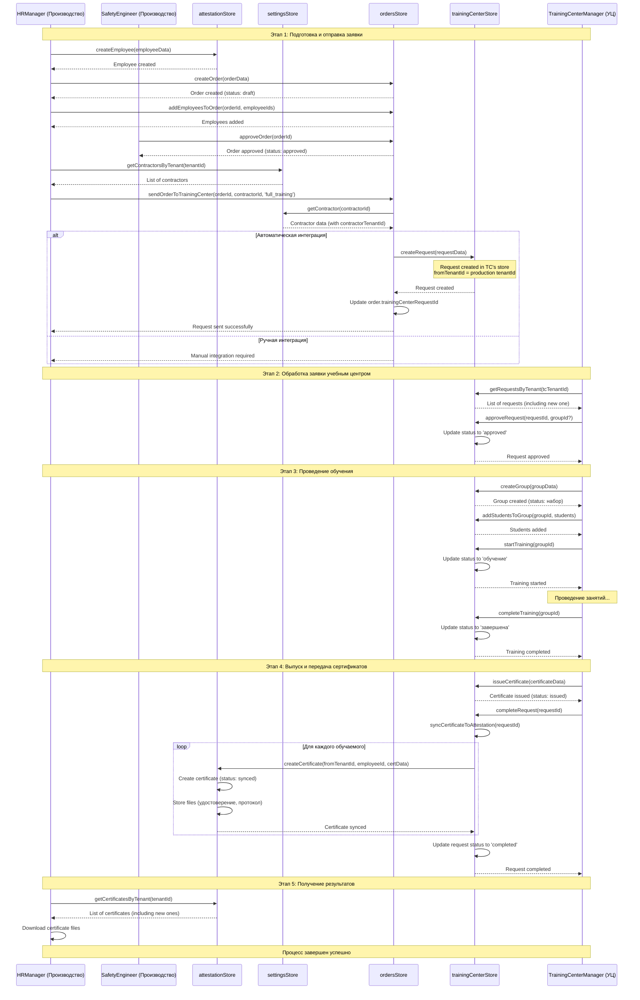

---

## Создание и согласование приказа

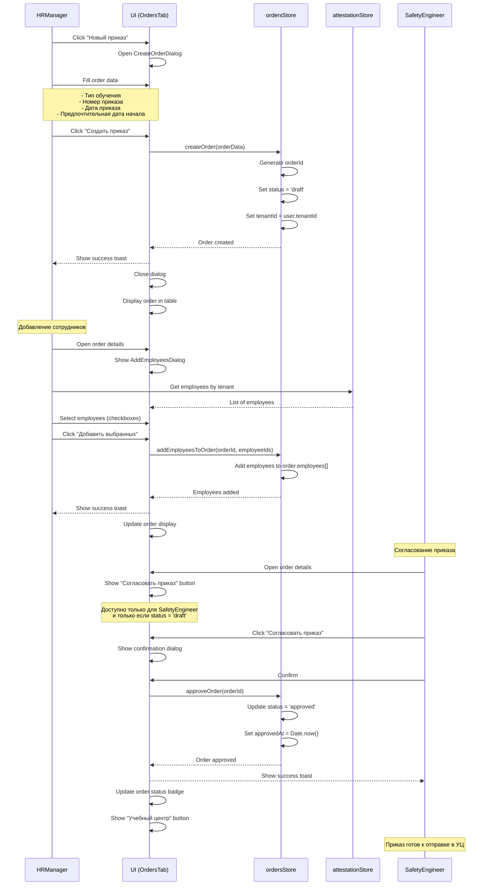

---

## Добавление контрагента с валидацией ID

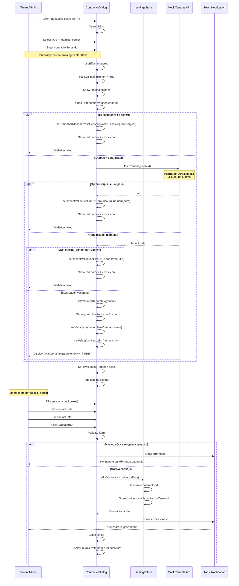

---

## Отправка заявки в учебный центр

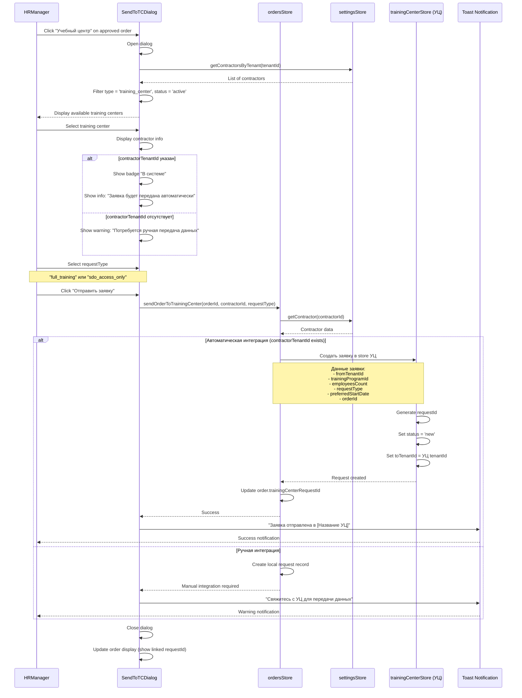

---

## Обработка заявки учебным центром

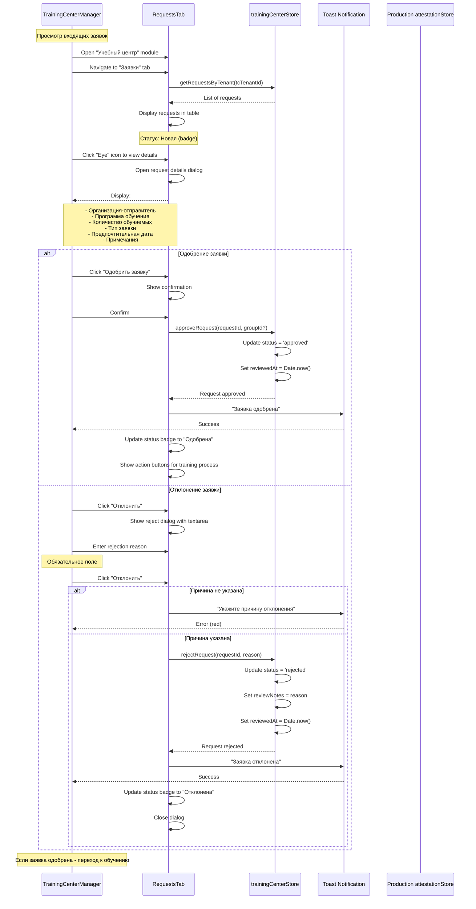

---

## Проведение обучения и выпуск сертификатов

```mermaid
sequenceDiagram
    participant TCM as TrainingCenterManager
    participant UI as GroupsTab
    participant TCS as trainingCenterStore
    participant Toast as Toast Notification

    Note over TCM: Создание группы обучения
    
    TCM->>UI: Navigate to "Группы" tab
    TCM->>UI: Click "Новая группа"
    
    UI->>UI: Open CreateGroupDialog
    
    TCM->>UI: Fill group data
    Note over TCM,UI: - Название группы<br/>- Программа обучения<br/>- Даты начала и окончания<br/>- Преподаватель
    
    TCM->>UI: Click "Создать"
    UI->>TCS: createGroup(groupData)
    
    TCS->>TCS: Generate groupId
    TCS->>TCS: Set status = 'набор'
    TCS-->>UI: Group created
    
    UI->>Toast: "Группа создана"
    Toast-->>TCM: Success
    
    Note over TCM: Добавление обучаемых
    
    TCM->>UI: Click "Добавить обучаемых"
    UI->>UI: Show student selection
    
    alt Импорт из заявки
        TCM->>UI: Select "Импортировать из заявки"
        UI->>TCS: getRequestEmployees(requestId)
        TCS-->>UI: List of employees from request
        UI->>TCS: addStudentsToGroup(groupId, students)
    else Добавить вручную
        TCM->>UI: Select "Добавить вручную"
        TCM->>UI: Fill student data manually
        UI->>TCS: addStudentsToGroup(groupId, students)
    end
    
    TCS->>TCS: Add students to group.students[]
    TCS-->>UI: Students added
    
    UI->>Toast: "Обучаемые добавлены"
    Toast-->>TCM: Success
    
    Note over TCM: Начало обучения
    
    TCM->>UI: Click "Начать обучение"
    UI->>UI: Show confirmation
    
    TCM->>UI: Confirm
    UI->>TCS: startTraining(groupId)
    
    TCS->>TCS: Update status = 'обучение'
    TCS->>TCS: Set startedAt = Date.now()
    TCS-->>UI: Training started
    
    UI->>Toast: "Обучение начато"
    Toast-->>TCM: Success
    
    UI->>UI: Disable editing students
    
    Note over TCM: Проведение занятий...
    
    Note over TCM: Завершение обучения
    
    TCM->>UI: Click "Завершить обучение"
    UI->>UI: Show confirmation
    
    TCM->>UI: Confirm
    UI->>TCS: completeTraining(groupId)
    
    TCS->>TCS: Update status = 'завершена'
    TCS->>TCS: Set completedAt = Date.now()
    TCS-->>UI: Training completed
    
    UI->>Toast: "Обучение завершено"
    Toast-->>TCM: Success
    
    Note over TCM: Выпуск сертификатов
    
    TCM->>UI: Navigate to "Сертификаты" tab
    TCM->>UI: Click "Выпустить сертификат"
    
    UI->>UI: Open IssueCertificateDialog
    
    TCM->>UI: Select student from completed group
    TCM->>UI: Select training program
    TCM->>UI: Enter certificate number
    TCM->>UI: Set issue date
    TCM->>UI: Set expiry date
    TCM->>UI: Attach files (удостоверение, протокол)
    
    TCM->>UI: Click "Выпустить"
    UI->>TCS: issueCertificate(certificateData)
    
    TCS->>TCS: Generate certificateId
    TCS->>TCS: Set status = 'issued'
    TCS->>TCS: Store files in certificate.files[]
    TCS-->>UI: Certificate issued
    
    UI->>Toast: "Сертификат выпущен"
    Toast-->>TCM: Success
    
    UI->>UI: Display certificate in table
```

---

## Синхронизация сертификатов между организациями

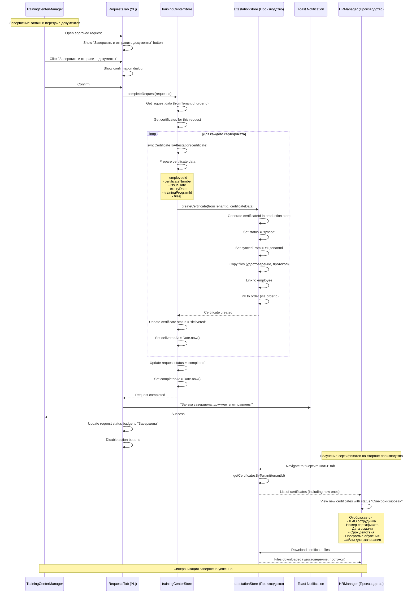

---

## Мониторинг истечения сертификатов

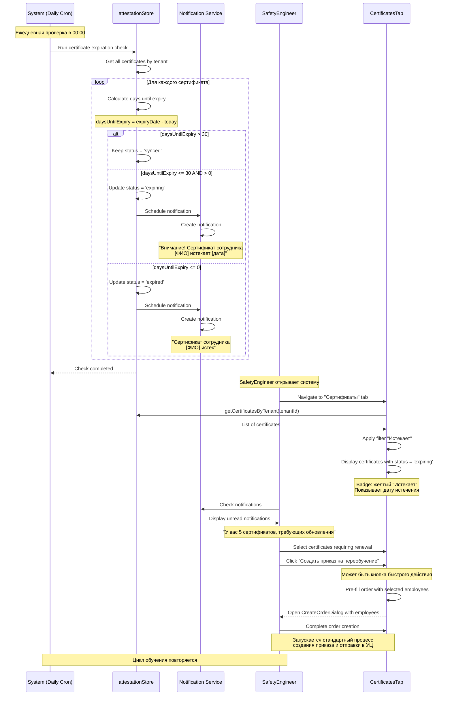

---

## Процесс предоставления доступа к СДО

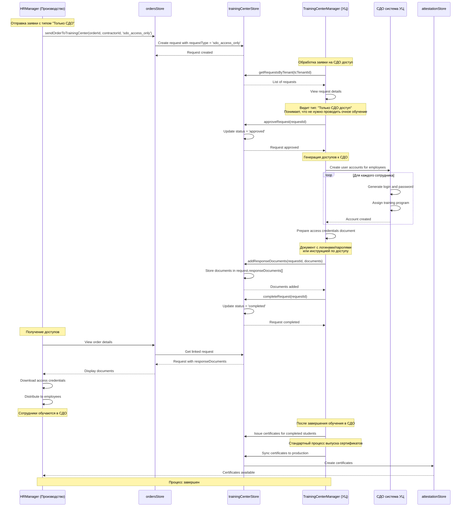

---

## Взаимодействие пользователей с разными ролями

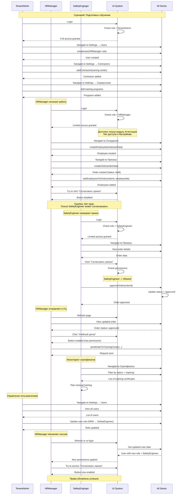

---

## Процесс обработки ошибок при интеграции

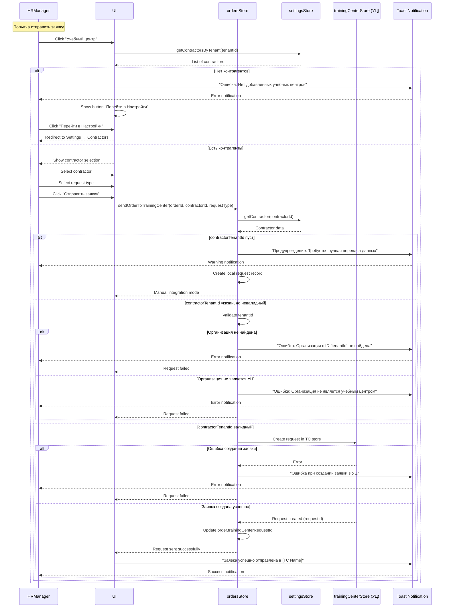

---

## Взаимодействие через межорганизационные документы

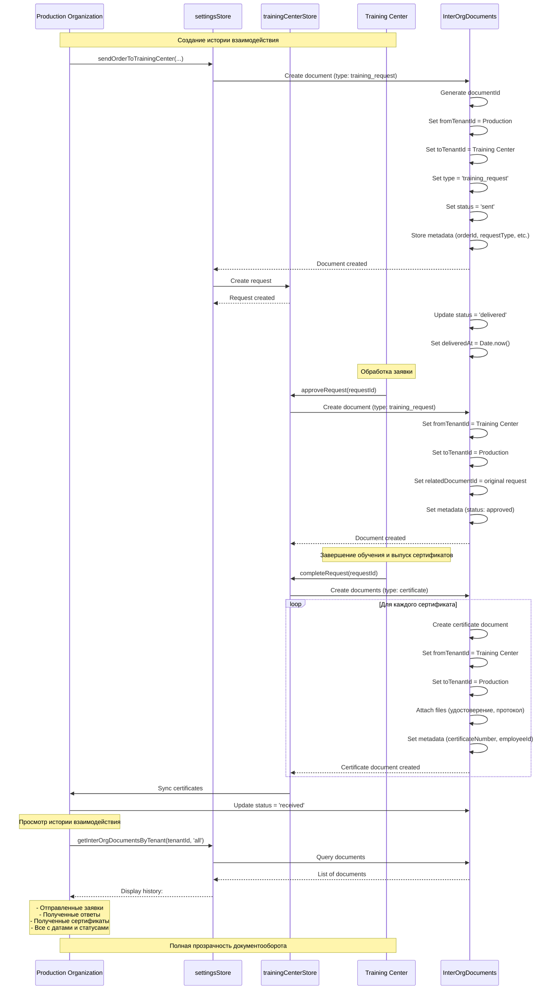

---

## Легенда

### Участники (Actors):
- **HRManager** - Менеджер по персоналу (производственная организация)
- **SafetyEngineer** - Инженер по охране труда (производственная организация)
- **TenantAdmin** - Администратор организации
- **TrainingCenterManager** - Менеджер учебного центра

### Хранилища (Stores):
- **attestationStore** - Хранилище данных модуля Аттестация
- **ordersStore** - Хранилище приказов
- **settingsStore** - Хранилище настроек и контрагентов
- **trainingCenterStore** - Хранилище учебного центра

### Системные компоненты:
- **UI** - Пользовательский интерфейс
- **Toast** - Уведомления для пользователя
- **API** - Внешние API (mock в примерах)
- **System** - Системные процессы (cron jobs)

### Типы сообщений:
- **→** Синхронный запрос
- **--→** Ответ/возврат данных
- **Note** - Комментарий или описание процесса

### Ключевые процессы:
1. **Автоматическая интеграция** - через contractorTenantId
2. **Ручная интеграция** - без contractorTenantId
3. **Синхронизация** - передача данных между тенантами
4. **Валидация** - проверка данных перед созданием
5. **Мониторинг** - автоматическое отслеживание статусов
