# Диаграмма связей сущностей проекта

Документ содержит диаграммы связей между всеми сущностями системы.

---

## Полная диаграмма связей

```mermaid
erDiagram
    %% ========================================
    %% ЯДРО СИСТЕМЫ: МУЛЬТИТЕНАНТНОСТЬ
    %% ========================================
    
    Tenant ||--o{ User : "имеет"
    Tenant ||--o{ SystemUser : "имеет"
    Tenant ||--o{ Organization : "владеет"
    Tenant ||--o{ ExternalOrganization : "сотрудничает"
    Tenant ||--o{ TrainingProgram : "предлагает"
    Tenant ||--o{ Competency : "определяет"
    Tenant ||--o{ BudgetCategory : "планирует"
    Tenant ||--o{ Checklist : "использует"
    Tenant ||--o{ KnowledgeDocument : "хранит"
    Tenant ||--o{ Notification : "отправляет"
    
    %% ========================================
    %% ПОЛЬЗОВАТЕЛИ И ПРАВА ДОСТУПА
    %% ========================================
    
    User ||--o{ Notification : "получает"
    User ||--o{ Task : "создаёт"
    User ||--o{ Task : "исполняет"
    User ||--o{ Audit : "проводит"
    
    SystemUser ||--o| Personnel : "связан с"
    SystemUser }o--o{ Organization : "имеет доступ к"
    
    %% ========================================
    %% ОРГАНИЗАЦИОННАЯ СТРУКТУРА
    %% ========================================
    
    Organization ||--o{ Organization : "содержит дочерние"
    Organization ||--o{ ProductionSite : "имеет"
    Organization ||--o{ Department : "содержит"
    Organization ||--o{ Personnel : "нанимает"
    Organization ||--o{ Incident : "регистрирует"
    Organization ||--o{ Audit : "проверяется"
    Organization ||--o{ IndustrialObject : "владеет"
    Organization ||--o{ Equipment : "эксплуатирует"
    Organization ||--o{ OrganizationBudgetPlan : "планирует бюджет"
    Organization ||--o{ CompetencyMatrix : "определяет требования"
    Organization ||--o{ OrganizationContractor : "работает с"
    Organization ||--o{ OrganizationTrainingRequest : "подаёт заявки"
    
    Department ||--o{ Department : "содержит подотделы"
    Department ||--o{ Personnel : "включает"
    
    ProductionSite ||--o{ Incident : "регистрирует"
    ProductionSite ||--o{ BudgetExpense : "несёт расходы"
    
    %% ========================================
    %% ПЕРСОНАЛ
    %% ========================================
    
    Person ||--o{ Personnel : "работает как"
    Person ||--o{ Certification : "имеет сертификаты"
    
    Position ||--o{ Personnel : "занимается"
    Position ||--o{ CompetencyMatrix : "требует компетенций"
    
    Personnel ||--o{ Task : "назначены задачи"
    Personnel ||--o{ Incident : "отвечает за"
    Personnel ||--o{ TrainingEnrollment : "обучается"
    Personnel ||--o{ TrainingInstructor : "преподаёт"
    Personnel ||--o{ GapAnalysis : "анализируется"
    
    %% ========================================
    %% КОМПЕТЕНЦИИ И СЕРТИФИКАЦИЯ
    %% ========================================
    
    Competency ||--o{ Certification : "подтверждается"
    Competency ||--o{ TrainingProgram : "развивается через"
    Competency ||--o{ CompetencyMatrix : "требуется для"
    
    CertificationArea ||--o{ Certification : "область для"
    CertificationArea ||--o{ CompetencyAreaRequirement : "входит в требования"
    
    Certification ||--o{ Notification : "уведомляет об истечении"
    
    CompetencyMatrix ||--o{ CompetencyAreaRequirement : "содержит"
    CompetencyMatrix ||--o{ GapAnalysis : "анализируется"
    
    GapAnalysis ||--o{ CompetencyGapReport : "включён в отчёт"
    
    %% ========================================
    %% ОБУЧЕНИЕ
    %% ========================================
    
    TrainingProgram ||--o{ TrainingGroup : "реализуется в"
    TrainingProgram ||--o{ OrganizationTrainingRequest : "запрашивается"
    
    TrainingGroup ||--o{ TrainingEnrollment : "содержит студентов"
    TrainingGroup ||--o{ TrainingScheduleEntry : "имеет расписание"
    
    TrainingLocation ||--o{ TrainingGroup : "проводится в"
    TrainingLocation ||--o{ TrainingScheduleEntry : "используется для"
    
    TrainingInstructor ||--o{ TrainingGroup : "ведёт"
    TrainingInstructor ||--o{ TrainingScheduleEntry : "проводит"
    
    OrganizationTrainingRequest ||--o{ InterOrgDocument : "генерирует документы"
    
    %% ========================================
    %% ИНЦИДЕНТЫ И КОРРЕКТИРУЮЩИЕ ДЕЙСТВИЯ
    %% ========================================
    
    Incident ||--o{ Task : "создаёт задачи"
    Incident ||--o{ BudgetExpense : "вызывает расходы"
    Incident ||--o{ Notification : "уведомляет"
    
    IncidentSource ||--o{ Incident : "источник для"
    IncidentDirection ||--o{ Incident : "направление для"
    IncidentFundingType ||--o{ Incident : "финансирование для"
    IncidentCategory ||--o{ IncidentSubcategory : "содержит"
    IncidentCategory ||--o{ Incident : "категория для"
    IncidentSubcategory ||--o{ Incident : "подкатегория для"
    
    %% ========================================
    %% ЧЕК-ЛИСТЫ И АУДИТЫ
    %% ========================================
    
    Checklist ||--o{ ChecklistItem : "содержит пункты"
    Checklist ||--o{ Audit : "используется в"
    
    Audit ||--o{ AuditFinding : "содержит результаты"
    Audit ||--o{ Incident : "выявляет"
    Audit ||--o{ Task : "создаёт задачи"
    Audit ||--o{ Notification : "уведомляет"
    
    ChecklistItem ||--o{ AuditFinding : "проверяется"
    
    %% ========================================
    %% ЗАДАЧИ
    %% ========================================
    
    Task ||--o{ Notification : "уведомляет"
    
    %% ========================================
    %% БЮДЖЕТ
    %% ========================================
    
    BudgetCategory ||--o{ BudgetExpense : "включает расходы"
    BudgetCategory ||--o{ BudgetSummary : "суммируется"
    BudgetCategory ||--o{ OrganizationBudgetCategory : "используется в плане"
    
    OrganizationBudgetPlan ||--o{ OrganizationBudgetCategory : "содержит категории"
    
    BudgetExpense ||--o{ Notification : "уведомляет о превышении"
    
    %% ========================================
    %% КАТАЛОГ ПРОМЫШЛЕННЫХ ОБЪЕКТОВ
    %% ========================================
    
    IndustrialObject ||--o{ ObjectDocument : "имеет документы"
    IndustrialObject ||--o{ Location : "расположен"
    IndustrialObject ||--o{ Notification : "уведомляет о сроках"
    
    %% ========================================
    %% ТЕХНИЧЕСКОЕ ОБСЛУЖИВАНИЕ
    %% ========================================
    
    Equipment ||--o{ Examination : "проходит освидетельствование"
    Equipment ||--o{ MaintenanceRecord : "обслуживается"
    Equipment ||--o{ Notification : "уведомляет о ТО"
    
    Examination ||--o{ Defect : "выявляет"
    Examination ||--o{ Task : "создаёт задачи"
    
    Defect ||--o{ Task : "требует устранения"
    
    %% ========================================
    %% ВНЕШНИЕ ОРГАНИЗАЦИИ
    %% ========================================
    
    ExternalOrganization ||--o{ OrganizationContractor : "является подрядчиком"
    ExternalOrganization ||--o{ Certification : "выдаёт сертификаты"
    
    OrganizationContractor ||--o{ OrganizationTrainingRequest : "принимает заявки"
    OrganizationContractor ||--o{ InterOrgDocument : "обменивается документами"
    
    %% ========================================
    %% МЕЖОРГАНИЗАЦИОННЫЙ ОБМЕН
    %% ========================================
    
    Tenant ||--o{ InterOrgDocument : "отправляет"
    Tenant ||--o{ InterOrgDocument : "получает"
    
    %% ========================================
    %% БАЗА ЗНАНИЙ
    %% ========================================
    
    KnowledgeDocument ||--o{ DocumentVersion : "имеет версии"
```

---

## Диаграмма по модулям

### 1. Модуль Аттестации

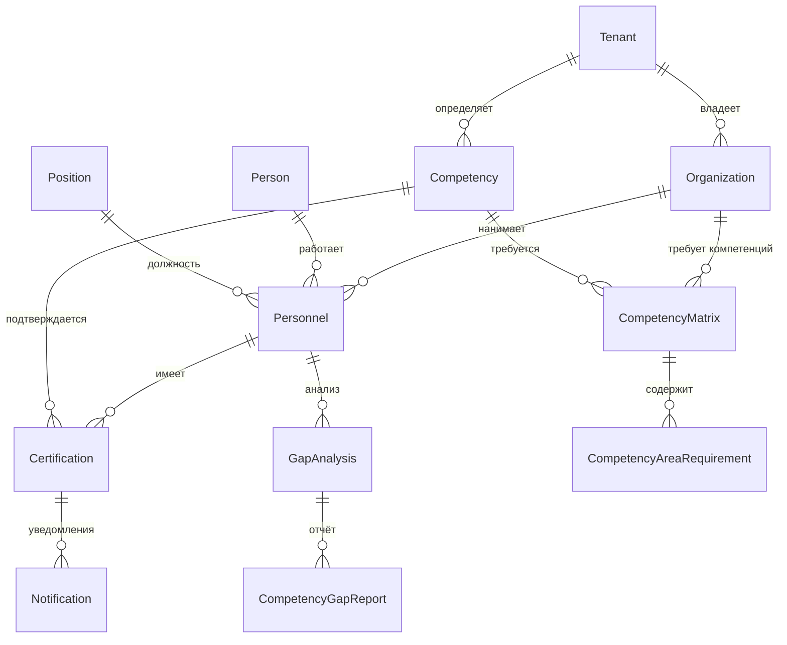

### 2. Модуль Учебного центра

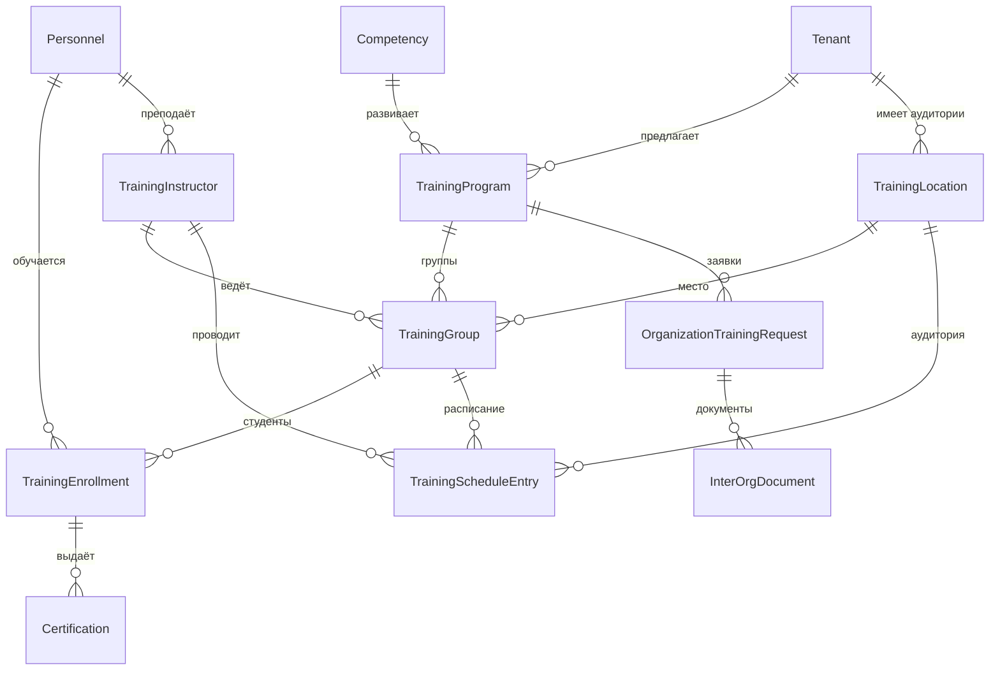

### 3. Модуль Инцидентов

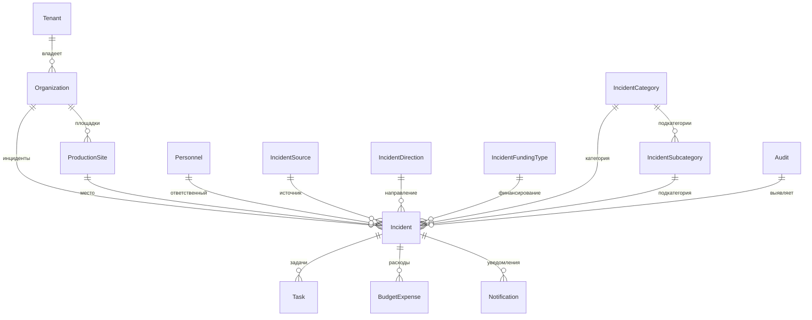

### 4. Модуль Чек-листов и Аудитов

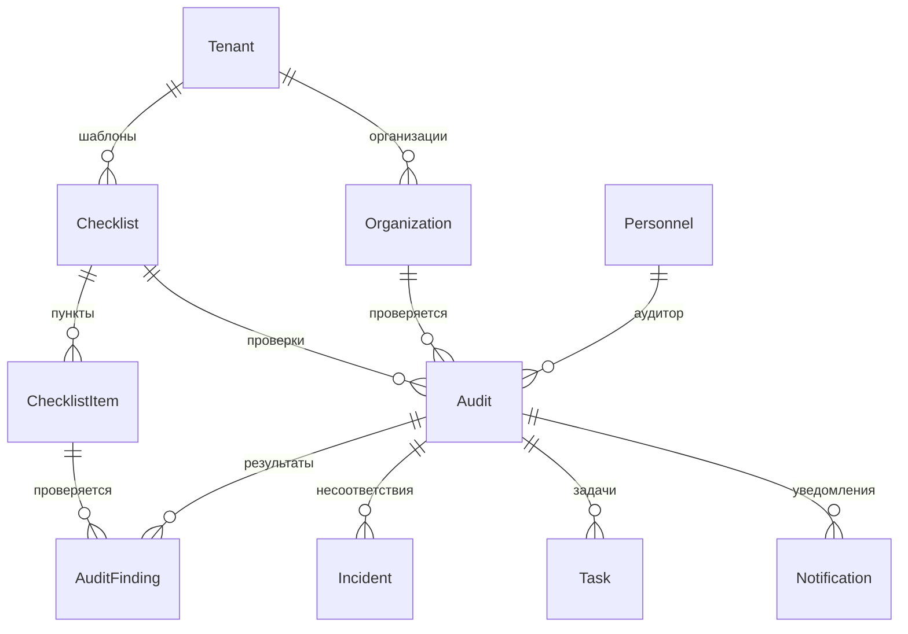

### 5. Модуль Бюджета

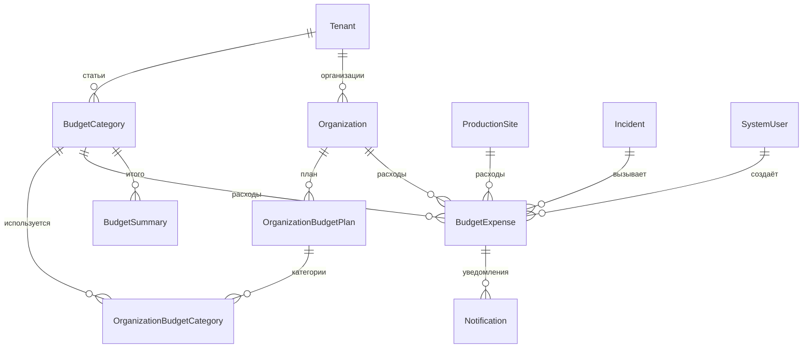

### 6. Модуль Каталога

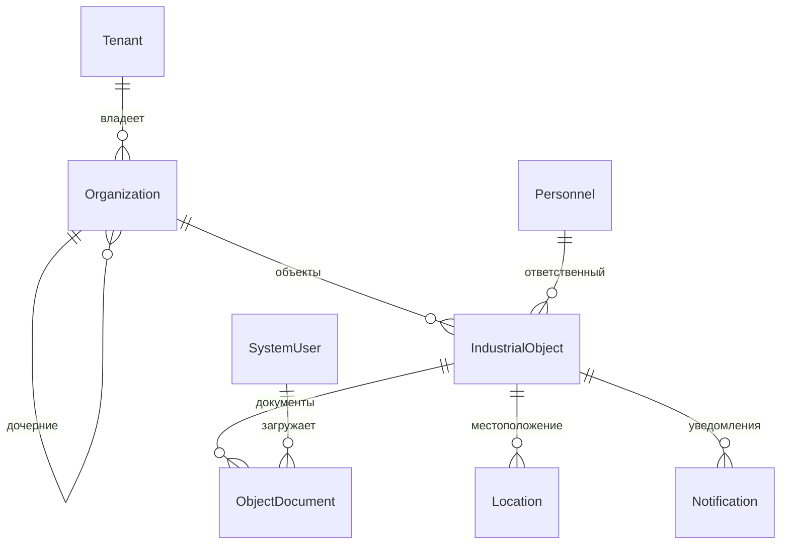

### 7. Модуль Технического обслуживания

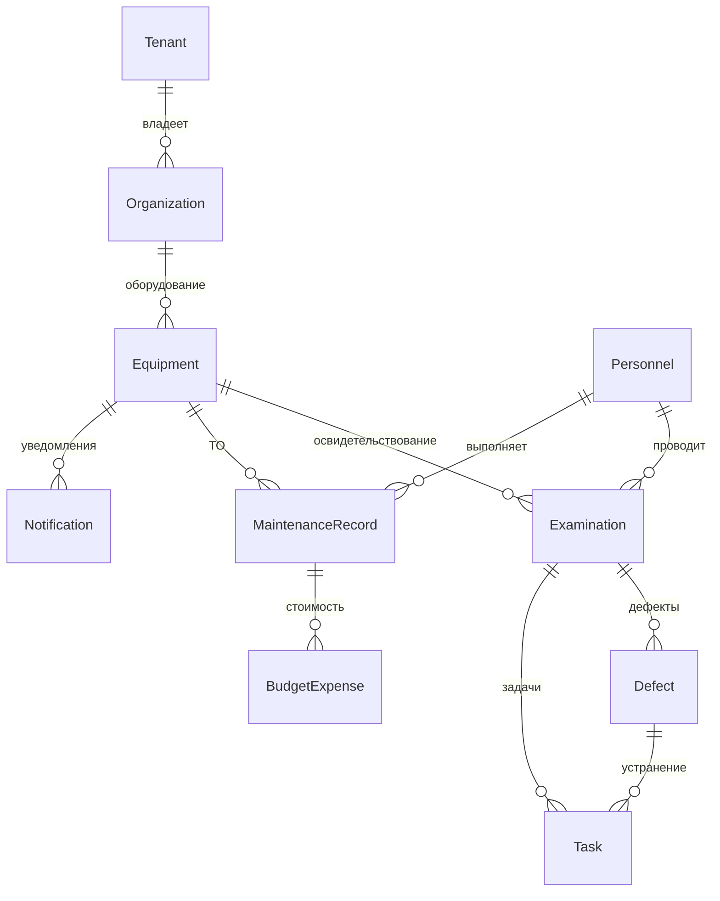

### 8. Модуль Задач

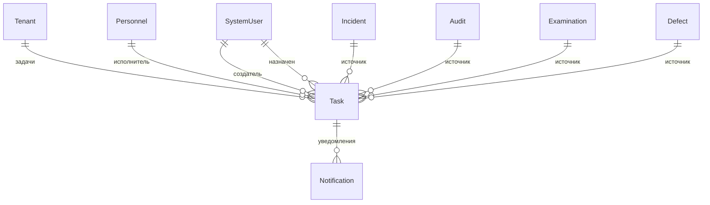

### 9. Модуль Подрядчиков

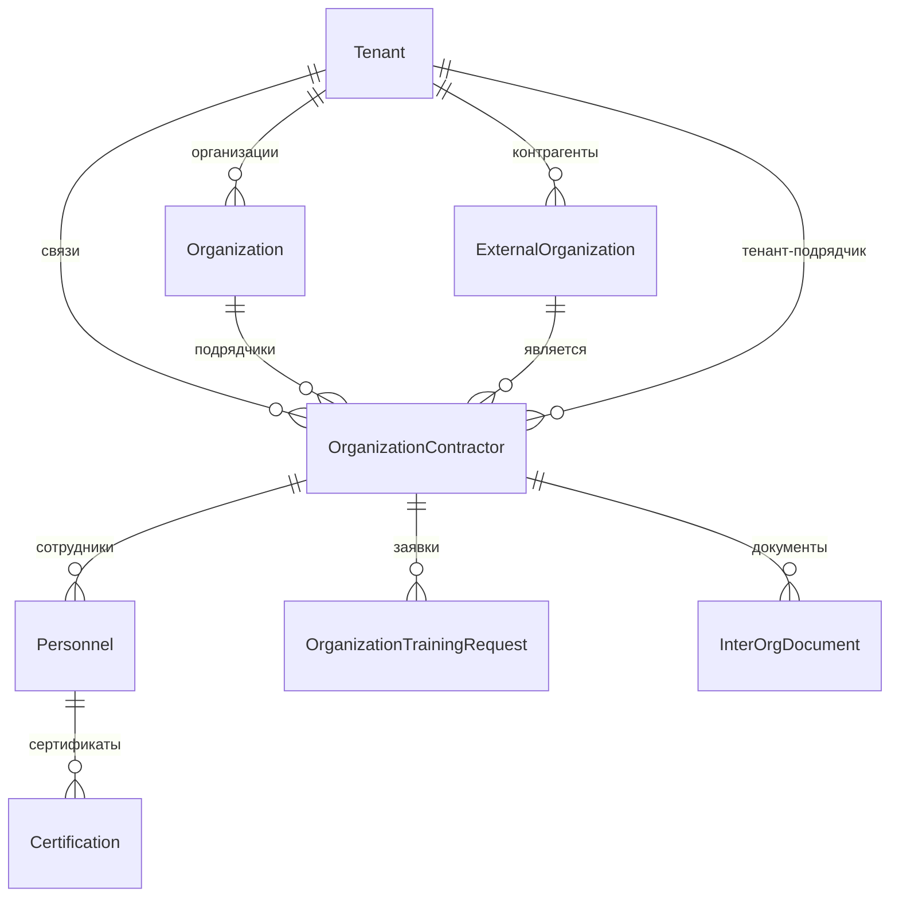

### 10. Модуль База знаний

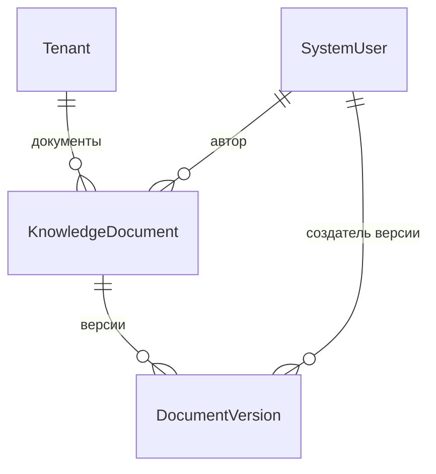

---

## Ключевые связи по типам

### One-to-Many (Один ко многим)

**Tenant** (центральная сущность):
- → Organization (организации)
- → User (пользователи)
- → SystemUser (системные пользователи)
- → TrainingProgram (программы обучения)
- → Competency (компетенции)
- → BudgetCategory (статьи бюджета)
- → Checklist (чек-листы)
- → KnowledgeDocument (документы)
- → ExternalOrganization (внешние организации)

**Organization**:
- → Organization (дочерние организации)
- → ProductionSite (производственные площадки)
- → Department (подразделения)
- → Personnel (персонал)
- → Incident (инциденты)
- → IndustrialObject (промышленные объекты)
- → Equipment (оборудование)
- → Audit (аудиты)

**Person**:
- → Personnel (записи о работе)
- → Certification (сертификаты)

**Personnel**:
- → Task (задачи)
- → TrainingEnrollment (обучение)
- → Incident (ответственность)

**Competency**:
- → Certification (подтверждения)
- → TrainingProgram (обучение)

**TrainingProgram**:
- → TrainingGroup (учебные группы)
- → OrganizationTrainingRequest (заявки)

**Incident**:
- → Task (задачи на устранение)
- → BudgetExpense (расходы)
- → Notification (уведомления)

### Many-to-Many (Многие ко многим)

**SystemUser ↔ Organization**:
- Через `organizationAccess` (пользователь имеет доступ к нескольким организациям)

**TrainingProgram ↔ Competency**:
- Через `competencyIds` (программа развивает несколько компетенций)

**Position ↔ Competency**:
- Через CompetencyMatrix (должность требует множество компетенций)

**Organization ↔ ExternalOrganization**:
- Через OrganizationContractor (организация работает с подрядчиками)

### One-to-One (Один к одному)

**SystemUser ↔ Personnel**:
- Системный пользователь может быть связан с одной записью персонала

**TrainingInstructor ↔ Personnel**:
- Преподаватель связан с одной записью персонала

---

## Индексы и оптимизация

### Рекомендуемые индексы для ключевых связей:

**Tenant-изоляция** (все таблицы):
- INDEX на `tenantId` для быстрой фильтрации данных тенанта

**Организационная иерархия**:
- INDEX на `organizationId` 
- INDEX на `parentId` (для Organization, Department)
- INDEX на `productionSiteId`

**Персонал**:
- INDEX на `personId`
- INDEX на `positionId`
- INDEX на `personnelId`

**Компетенции**:
- INDEX на `competencyId`
- INDEX на `employeeId`
- COMPOSITE INDEX на `(personId, competencyId, expiryDate)` для быстрого поиска действующих сертификатов

**Статусы и даты**:
- INDEX на `status` для всех сущностей со статусами
- INDEX на `expiryDate`, `completedDate`, `dueDate` для временных запросов

**Связи модулей**:
- INDEX на `sourceType, sourceId` для Task
- INDEX на `groupId` для TrainingEnrollment
- INDEX на `categoryId` для BudgetExpense

---

## Правила каскадного удаления

### CASCADE DELETE (удалять связанные):
- Tenant → все зависимые сущности
- Organization → дочерние Organization (рекурсивно)
- Checklist → ChecklistItem
- Audit → AuditFinding
- Equipment → Examination, MaintenanceRecord
- KnowledgeDocument → DocumentVersion

### SET NULL (обнулять связь):
- Personnel → SystemUser (при удалении пользователя)
- TrainingGroup → TrainingInstructor (при удалении преподавателя)
- Organization → Personnel.organizationId (при удалении организации)

### RESTRICT (запретить удаление):
- Person (если есть Personnel)
- Position (если есть Personnel)
- Competency (если есть Certification)
- BudgetCategory (если есть BudgetExpense)
- Organization (если есть IndustrialObject или Equipment)

---

## Бизнес-процессы и связи

### Процесс аттестации:
1. Person → Personnel (найм)
2. Position + Organization → CompetencyMatrix (требования)
3. CompetencyMatrix → GapAnalysis (анализ)
4. GapAnalysis → OrganizationTrainingRequest (заявка на обучение)
5. TrainingRequest → TrainingGroup → TrainingEnrollment (обучение)
6. TrainingEnrollment → Certification (выдача удостоверения)
7. Certification → Notification (уведомление об истечении)

### Процесс управления инцидентами:
1. Audit → AuditFinding (проверка)
2. AuditFinding (fail) → Incident (регистрация)
3. Incident → Task (создание задачи)
4. Task → Personnel (назначение ответственного)
5. Incident → BudgetExpense (учёт расходов)
6. Task (completed) → Incident (completed) → Notification

### Процесс межорганизационного взаимодействия:
1. Organization → OrganizationContractor (установка связи)
2. OrganizationTrainingRequest (заявка от организации)
3. TrainingRequest → InterOrgDocument (обмен документами)
4. InterOrgDocument → TrainingGroup (формирование группы)
5. TrainingEnrollment → Certification (обучение)
6. Certification → InterOrgDocument (передача удостоверений)

---

**Всего связей в системе:** ~150+ прямых связей между 69 сущностями
